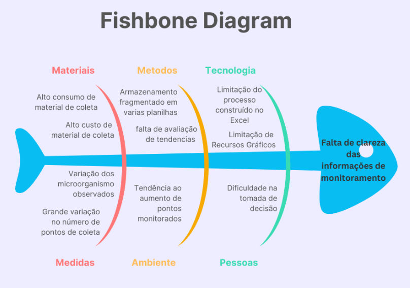

# VISÃO DO PRODUTO

## Problema

OO problema enfrentado pelo setor responsável pela Setor de Qualidade é a dificuldade em gerenciar e monitorar adequadamente as informações microbiológicas no ambiente de produção, devido à dependência de planilhas e à falta de um sistema centralizado.

1. **Por que o monitoramento é difícil de gerenciar?**  
  Porque os dados estão distribuídos em várias planilhas, o que dificulta a integração e consolidação das informações necessárias para análise.

2. **Por que os dados estão fragmentados?**  
  Porque, embora o Excel, ferramenta utilizada pelo cliente, tenha potencial para realizar um monitoramento mais complexo, a forma como as planilhas e os dados estão estruturados internamente não permite explorar plenamente essa funcionalidade.

3. **Por que o Excel é usado como sistema principal?**  
   Porque é uma ferramenta amplamente conhecida e utilizada pela equipe, o que reduz a curva de aprendizado, mas, ao mesmo tempo, limita a exploração de soluções mais robustas e especializadas.

4. **Por que não há uma alternativa especializada?**  
   Porque o núcleo interno de sistemas não possui capacidade operacional para atender a demandas específicas do setor, e o desenvolvimento de uma solução dedicada é inviável devido à escassez de recursos humanos e tecnológicos.

**Causa do Problema**  
A causa do problema é a falta de clareza das informações de monitoramento microbiológico.

Figura 1: Diagrama de Ishikawa.

## Objetivos do Produto

**Objetivo Principal: Centralizar os dados de monitoramento microbiológico**

- **Centralização Completa**: Consolidar todas as informações microbiológicas em uma plataforma única, eliminando a fragmentação atual em múltiplas planilhas e proporcionando um repositório único e organizado de dados.

## Objetivos Secundários

**Facilitar a visualização dos dados para análise rápida**

- **Armazenamento Seguro e Acessível**: Garantir que os dados estejam seguros e acessíveis para a equipe de microbiologia, facilitando o registro e consulta de informações de maneira prática e eficiente.

- **Painel de Visualização**: Oferecer um dashboard intuitivo e interativo que apresenta dados microbiológicos de maneira clara e acessível, permitindo uma visão geral rápida do status de monitoramento.
- **Comparação de Dados**: Permitir a comparação de dados entre diferentes períodos e locais, auxiliando na análise detalhada e na avaliação da consistência e qualidade microbiológica ao longo do tempo.

- **Apoio Estratégico na Tomada de Decisão**: Facilitar a tomada de decisão, proporcionando uma visualização mais detalhada e estruturada dos dados microbiológicos. A longo prazo, isso permitirá à equipe identificar tendências e tomar decisões mais informadas e estratégicas para a melhoria contínua do processo de monitoramento.

- **Facilitar auditoria**: Essa visualização ajudará a equipe e auditores a fazer as analises, proporcionando uma visão mais transparente dos dados microbiológicos.

## Tecnologias a serem utilizadas

| Atividade | Tecnologia   |
| :--------: |  :--------: |
| **Front-end** |    React      |
| **Back-end** |     Noje.js      |
| **Banco de Dados** |   PostgreSQL  |
| **Reuniões** |     Teams      |
| **Prototipagem** |   Figma    |

##  Histórico de Versão

| **Data** | **Versão** | **Descrição** | **Autor** |
| :--------: | :--------: | :--------:  | :--------: | 
|      10/11/2024      |      1.0      |      Criação do documento       |     Breno Fernandes, Breno Lucena, Storch, João, Rafael e Renan     |
| 4/12/2024 | 1.1 | Descaracterização do clinte no texto	| Guilherme Storch | 